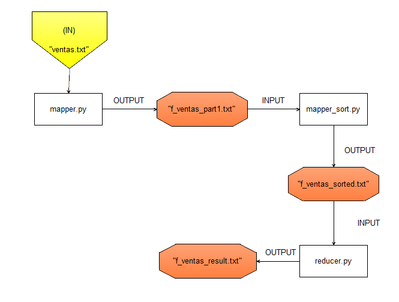
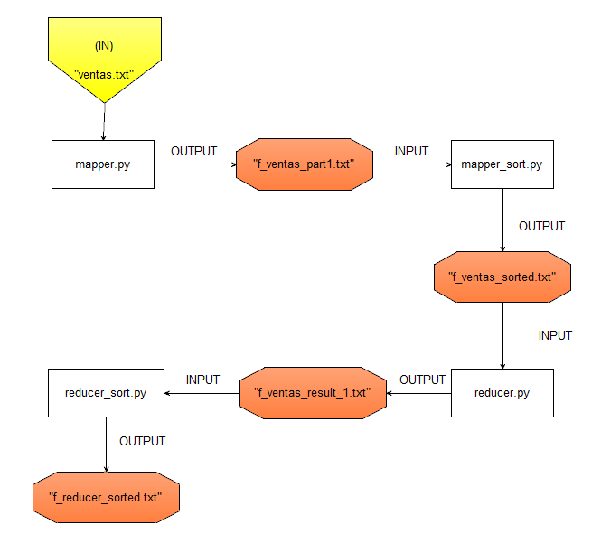

# Trabajo Practico N° 6
# Nociones de Frameworks de Procesamiento Masivo

### Genere un esquema bajo el paradigma MapReduce para resolver las siguientes consignas:

#### a) Produzca un mapper y un reducer para responder a cuál es el bonus obtenido por cada vendedor siendo que cada vendedor obtiene el 3% del total del dinero vendido.

```
 X * 0.03 = es el 3% del total vendido
```
agrego un diagrama explicativo de los algortimos para la resolucion del punto. 



* En la primera parte el "mapper.py": armo los pares {llave, valor}
* Luego en "mapper_sort.py" los ordeno: paso importante para luego poder hace el reducer.
* En "reducer.py": voy comparando linea a linea y cuando el "id_vendedor" cambia renuevo el contador y guardo en un archivo de salida "f_ventas_result.py"

Los script ordendados son como sigue: 
* mapper.py
* mapper_sort.py
* reducer.py


#### b) Produzca un mapper y un reducer para obtener la cantidad de productos vendidos por cada vendedor, agrupado por coordinador.

agrego un diagrama explicativo del algoritmo. 



Agregue un script para correr todos los scripts juntos. "script.py"


