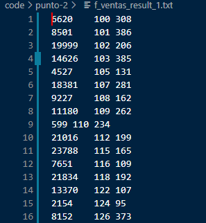
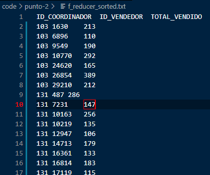

# Trabajo Practico N° 6
# Nociones de Frameworks de Procesamiento Masivo

### Genere un esquema bajo el paradigma MapReduce para resolver las siguientes consignas:

#### a) Produzca un mapper y un reducer para responder a cuál es el bonus obtenido por cada vendedor siendo que cada vendedor obtiene el 3% del total del dinero vendido.

```
 X * 0.03 = es el 3% del total vendido
```
agrego un diagrama explicativo de los algortimos para la resolucion del punto. 


Los script ordendados son como sigue: 
* mapper.py : en esta parte creo la estructura {clave valor}, falta ordenar.. 
* mapper_sort.py : aqui ordeno por id_vendedor, quedandome como resultado una estructura que falta reducir.
* reducer.py : voy comparando linea a linea y cuando el "id_vendedor" cambia renuevo el contador y guardo en un archivo de salida "f_ventas_result.py". 

Enlace a la carpeta con los script y archivos resultantes [Punto 1](code/punto-1)

Agregue un script para correr todos los ["script.py"](code/punto-1/scripts.py) juntos y en orden. 

#### b) Produzca un mapper y un reducer para obtener la cantidad de productos vendidos por cada vendedor, agrupado por coordinador.

Agrego un diagrama explicativo del algoritmo. 


Los pasos son como siguen: 

* mapper.py : en esta parte armo el esquema {id_coordinador, id_vendedor, cant_prod_vendidos}, aun no sumo los totales por vendedor. Como salida tengo una lista, con la estructura [id_coordinador, id_vendedor, cant_prod_vendidos]

* mapper_sort.py : aqui ordeno por vendedor quedandome de esta forma 


en este algoritmo la parte mas importante es la de ordenamiento..

```
def convertir_id(line):
    line = line.strip()
    linea_split = []
    linea_split = line.split("\t") 
    # PARTE IMPORTANTE DEL SORT, SELECCIONO LA COLUMNA POR LA CUAL
    # QUIERO ORDENAR, EN ESTE CASO COLUMNA ID_VENDEDOR
    # PARA DESPUES HACER EL ACUMULADOR DE CANT_VENTAS_REALIZADAS 
    return int(linea_split[1])
``` 
Retornando la columna por la cual quiero ordenar. Luego el ciclo for hace el resto..

* reducer.py: En esta parte sumo los subtotales de productos vendidos por vendedor quedando el resultado como sigue



aca tengo los vendedores con los totales vendidos. Ahora me falta hacer un orden por vendedor. 

* reducer_sort.py: aplico el mismo paso de ordenamiento realizado en el "mapper_sorted" pero para ordenar por coordinador



Enlace a la carpeta con los script y archivos resultantes [Punto 2](code/punto-2)

Agregue un script para correr todos los ["script.py"](code/punto-2/scripts.py) juntos y en orden. 

#### Apache Spark con PySpark: Resuelva el ejercicio anterior con PySpark.

La parte mas importante de la consigna es como sigue

```
!wget https://raw.githubusercontent.com/bdm-unlu/2020/master/TPs/TP06/data/ventas.txt

RDD_ventas = sc.textFile("/content/ventas.txt").\
           map(lambda line: line.split("\t")).\
           map(lambda d: (int(d[0]), float(d[3]) )).\
           reduceByKey(lambda x, y: x + y)

RDD_ventas2 = RDD_ventas.map(lambda d: (int(d[0]), float(d[1])*0.03))

RDD_ventas2.sortByKey().collect()
``` 
De lo que se obtiene todos los vendedores ordenados y con el total de productos vendidos. 

Inconvenientes solucionados:

* La lectura del archivo, le faltaba la lectura tipo raw
* Agregada la instruccion para que se multiplique el 3% de las ventas. 


```
RDD_ventas2 = RDD_ventas.map(lambda d: (int(d[0]), float(d[1])*0.03))
```


## Luego del punto 2, realice la siguiente resolucion en colab. Primero obtuve 2 RDD, 
* Uno con los vendedores y sus totales de productos vendidos

```
RDD_ventas_cant_product = scventas.textFile("/content/ventas.txt").\
           map(lambda line: line.split("\t")).\
           map(lambda d: (int(d[0]), int(d[2]) )).\
           reduceByKey(lambda x, y: x + y)

RDD_ventas_cant_product = RDD_ventas_cant_product.map(lambda d: (int(d[0]), [int(d[1])]))

RDD_ventas_cant_product.sortByKey().collect()
```

* Otro RDD con los vendedores y coordinadores

```
RDD_ventas_coord = scventas.textFile("/content/ventas.txt").\
           map(lambda line: line.split("\t")).\
           map(lambda d: (int(d[0]), int(d[1]) ))

```
* Y finalmente realizando una union entre los RDD obtenidos

```

RDD_ventas_coord.union(RDD_ventas_cant_product).reduceByKey(lambda x, y: x + y).sortByKey().collect()
```

Adjunto el enlace al [Colab](https://colab.research.google.com/drive/1G8CdO2QuCeRk_8n1OyrytgpC420aiT8z?usp=sharing) Actualizado
